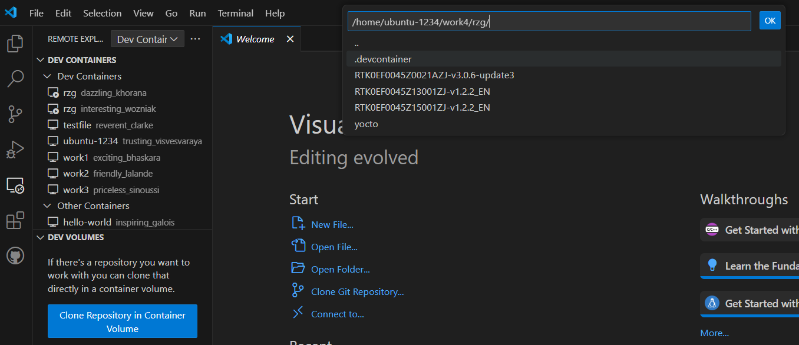

# **Setting Up Yocto Build Environment for Renesas RZ-G2L**

This guide provides step-by-step instructions to set up a Yocto build environment for the Renesas RZ-G2L board.

---

## **1. Create a Working Folder**
```bash
mkdir -p ~/work/rzg
cd ~/work/rzg
```

---

## **2. Download and Move `rzg.tar.gz`**
- Download the file from [http://192.168.113.104/rz/moil/rzg/](http://192.168.113.104/rz/moil/rzg/).
- Drag the downloaded `rzg.tar.gz` file into the `~/work/rzg` folder using Visual Studio Code.

---

## **3. Extract `rzg.tar.gz`**
```bash
tar xzvf rzg.tar.gz
```

---

## **4. Open Folder in a Development Container**
- Open the `~/work/rzg` folder in a new development container using Visual Studio Code.

---

## **5. Download Additional Packages**
- Download the following 3 files (Graphics, Video Codec & VLP) from [http://192.168.113.104/rz/RZG/](http://192.168.113.104/rz/RZG/):
``` bash
  - RTK0EF0045Z0021AZJ-v3.0.6-update3.zip
  - RTK0EF0045Z13001ZJ-v1.2.2_EN.zip
  - RTK0EF0045Z15001ZJ-v1.2.2_EN.zip
```
---

## **6. Configure Git**
```bash
git config --global user.email "you@example.com"
git config --global user.name "Your Name"
```

---

## **7. Unzip the 3 Packages**
```bash
unzip RTK0EF0045Z0021AZJ-v3.0.6-update3.zip
unzip RTK0EF0045Z13001ZJ-v1.2.2_EN.zip
unzip RTK0EF0045Z15001ZJ-v1.2.2_EN.zip
```

---

## **8. Create and Navigate to `yocto` Folder**
```bash
mkdir -p ~/work/rzg/yocto
cd ~/work/rzg/yocto
```

---

## **9. Extract VLP, Graphics, and Video Codec Files**
```bash
tar zxvf ../RTK0EF0045Z0021AZJ-v3.0.6-update3/rzg_vlp_v3.0.6.tar.gz
tar zxvf ../RTK0EF0045Z13001ZJ-v1.2.2_EN/meta-rz-features_graphics_v1.2.2.tar.gz
tar zxvf ../RTK0EF0045Z15001ZJ-v1.2.2_EN/meta-rz-features_codec_v1.2.2.tar.gz
```

---

## **10. Apply VLP Update Patch**
```bash
patch -p1 < ../RTK0EF0045Z0021AZJ-v3.0.6-update3/vlpg306-to-vlpg306update3.patch
```
xaxaxsax
---

## **11. Apply Additional Patch Files**
Download the extra patches from [this source](https://m11158002.github.io/moil-renesas/docs/note/renesas/rzg) and apply them:
```bash
patch -p1 < ../extra/0001-rz-common-recipes-debian-buster-glibc-update-to-v2.2.patch

patch -p1 < ../extra/0001-rz-common-linux-update-linux-kernel-to-the-latest-re.patch

patch -p1 < ../extra/0001-rz-common-gst-plugins-bad-Depending-bayer2raw-if-lay.patch

patch -p1 < ../extra/0001-gstreamer-moil-plugin-91a25cd4d16fc479aefd2aa853466770.patch

patch -p1 < ../extra/0002-fix_qtsmarthome_url-db1d20dcf1b5af60dc7034e78271ddc2.patch
```

---

## **12. Initialize Yocto Build Environment**
```bash
TEMPLATECONF=$PWD/meta-renesas/meta-rzg2l/docs/template/conf/ source poky/oe-init-build-env build
```

---

## **13. Add Necessary Layers**
Update `build/conf/bblayers.conf` by adding the following layers:
```bash
bitbake-layers add-layer ../meta-rz-features/meta-rz-graphics
bitbake-layers add-layer ../meta-rz-features/meta-rz-codecs
bitbake-layers add-layer ../meta-qt5
```

---

## **14. Add Custom Configuration**
Append the following to `conf/local.conf`:
```bash
QT_DEMO = "1"

IMAGE_INSTALL_append = " kernel-module-uvcvideo "
EXTRA_IMAGE_FEATURES_append = " ssh-server-openssh "

IMAGE_INSTALL_append = " curl graphviz "
IMAGE_INSTALL_append = " gst-instruments gst-shark "
PACKAGECONFIG_append_pn-gstreamer1.0 = " tracer-hooks "
```

---

## **15. Build Weston Image**
```bash
MACHINE=smarc-rzg2l bitbake core-image-weston
```

---

## **16. Prepare SD Card**
1. Insert the SD card and check its device name:
   ```bash
   sudo fdisk -l
   ```
2. Unmount any mounted partitions:
   ```bash
   sudo umount /dev/sda
   ```
3. Copy the image to the SD card:
   ```bash
   sudo bmaptool copy <wic image>.wic.gz /dev/sda
   ```

---

## **17. Boot the Board**
1. Insert the SD card into the RZ-G2L board.
2. Power on the board.
3. Open the serial monitor in VS Code:
   - Set the baud rate to `115200`.

---

## **18. Additional Notes**
- Ensure all dependencies (`bmap-tools`, `unzip`, etc.) are installed on the host machine.
- Manual steps like dragging files in VS Code are required as specified.
```
